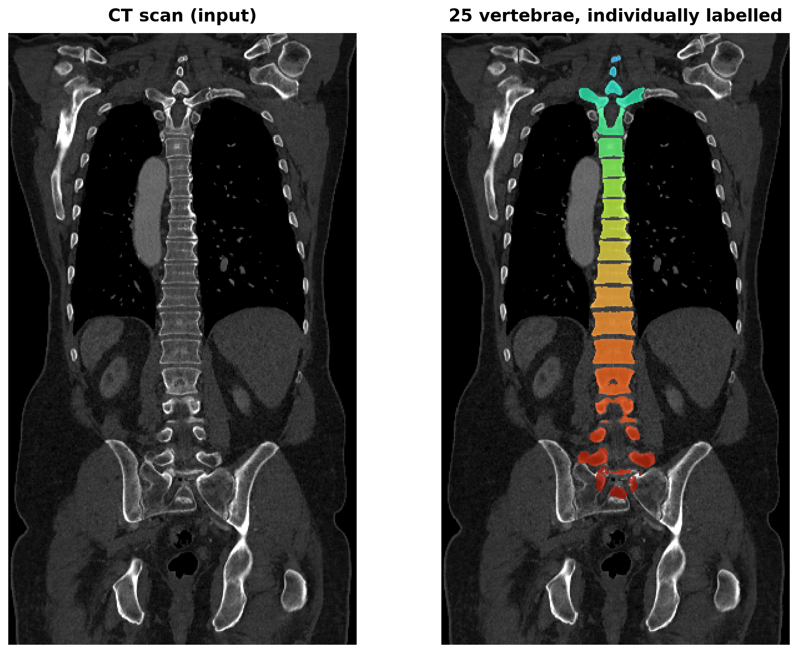
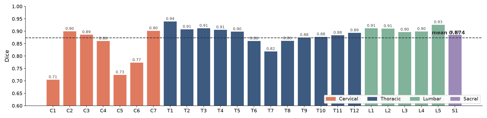
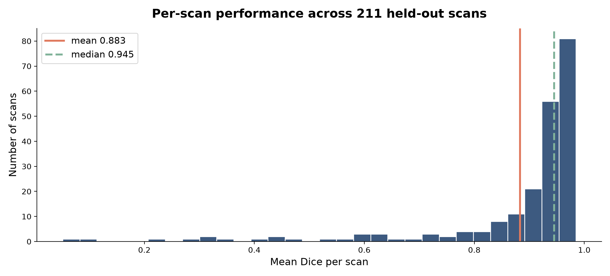
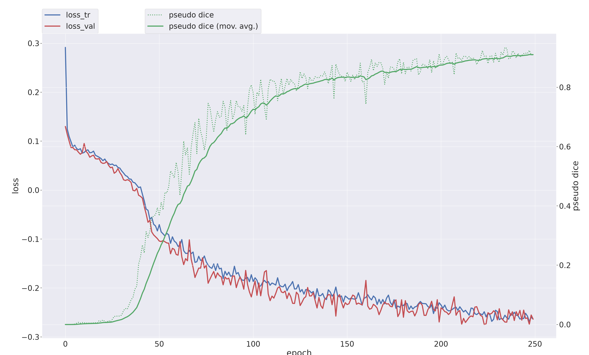

# Multiclass Spine Segmentation with nnU-Net v2

Automatic labelling of **25 individual vertebrae** in CT scans — C1 through S1 — using a self-configuring 3D U-Net.

**0.8736 mean Dice** on 218 scans held out before training and evaluated once, at the end.

<p align="center">
  
</p>

---

## Results

Evaluated on **218 CT scans** that were separated before any training ran and never used for training, validation, or model selection.

| Metric | Value |
|---|---|
| **Mean Dice (holdout, n=218)** | **0.8736** |
| Mean IoU (holdout) | 0.8307 |
| Cross-validation Dice (fold 0, n=174) | 0.8837 |
| Best class — T1 | 0.9403 |
| Worst class — C1 | 0.7058 |



Full per-class table: [`results/per_class_scores.md`](results/per_class_scores.md) · raw output: [`results/holdout_summary.json`](results/holdout_summary.json)

### Per-scan distribution



| | |
|---|---|
| Scans scoring ≥ 0.90 | 155 / 218 |
| Scans scoring ≥ 0.80 | 181 / 218 |
| Scans scoring < 0.60 | 15 / 218 |

### Where it fails, and why

**Every weak class is cervical.** C1 (0.706), C5 (0.726) and C6 (0.775) are the three lowest; every thoracic and lumbar vertebra scores between 0.82 and 0.93.

Two causes:

1. **Dice penalises small structures disproportionately.** C1 averages ~730 voxels against L1's ~10,300. A fixed number of misassigned boundary voxels costs far more Dice on a small bone than a large one.
2. **Cervical vertebrae are underrepresented.** Most studies in the dataset are chest or abdomen, so the neck is frequently clipped at the edge of the field of view.

This points at a data problem rather than a modelling one — the actionable next step is cervical-weighted training data, not more epochs.

---

## Method

nnU-Net is **self-configuring**: given a correctly formatted dataset it derives the architecture and training schedule from the data itself. No network was designed by hand here.

| Specified by me | Derived by nnU-Net |
|---|---|
| Folder layout and file naming | Patch size 128×128×128, batch size 2 |
| Modality is CT | 6-stage encoder, 32→320 features |
| 25 vertebra labels | Resample to 1.5 mm isotropic |
| Train / holdout split | CT intensity normalisation |
| Epoch budget | Rejected a low-res cascade as unhelpful |

The exact configuration it chose is committed at [`results/model_config/plans.json`](results/model_config/plans.json).

### Configuration

```
Architecture    3D U-Net (nnU-Net v2, 3d_fullres)
Training        250 epochs, fold 0, Dice + cross-entropy
Hardware        1× RTX 4090 (24 GB), rented
Training time   2 h 10 min
Data            871 train / 218 holdout, 26 classes with background
Inference       sliding window, 8× test-time augmentation
```

### Training behaviour



Dice sits near zero until roughly epoch 30 — with 26 classes and ~99% background voxels, the network first learns to predict background everywhere. It then climbs steeply through epoch 150 before flattening as the learning rate decays. Training and validation loss track each other to the final epoch, with no divergence.

Full log: [`results/training_log.txt`](results/training_log.txt)

---

## Data preparation

Model design is automated; **data preparation is where the engineering actually goes.** If the input format is wrong there is no architecture to blame.

[`prepare_dataset.py`](prepare_dataset.py) converts two flat folders of scans and masks into a valid nnU-Net raw dataset:

- **Refuses to run on any unpaired file.** A scan without its label trains as if everything in it is background, silently degrading the model.
- **Verifies voxel geometry per case.** nnU-Net rejects an entire dataset if one scan and its label disagree on size, spacing, origin or orientation — even by a rounding error. Mismatched cases are skipped and reported rather than aborting the run.
- **Fixed random seed**, so the split is reproducible and reported scores can be regenerated.
- **Compresses `.nii` → `.nii.gz`**, roughly 70% smaller.
- **Parallel across CPU cores.** 1,089 cases in 45 seconds on 30 workers, versus ~40 minutes serially. Verified byte-identical to the serial implementation.

```bash
python prepare_dataset.py \
  --volumes  /path/to/scans \
  --labels   /path/to/masks \
  --out      /path/to/nnUNet_raw \
  --dataset-id 100 --dataset-name SPINE \
  --holdout 0.2 --seed 42 --workers 30
```

### On the split

nnU-Net performs 5-fold cross-validation internally on whatever it finds in `imagesTr`. A hand-made third "validation" split is therefore redundant, and hides data from the framework that it wanted to cross-validate over. This project uses **two buckets**:

- `imagesTr` (871) — nnU-Net folds this itself; validation comes from here
- `imagesTs` (218) — untouched until final evaluation

---

## Reproducing

```bash
# 1. Prepare
python prepare_dataset.py --volumes … --labels … --out $nnUNet_raw \
  --dataset-id 100 --dataset-name SPINE

# 2. Plan and preprocess — nnU-Net designs the model here
nnUNetv2_plan_and_preprocess -d 100 -c 3d_fullres --verify_dataset_integrity -np 30

# 3. Train
nnUNetv2_train 100 3d_fullres 0 -tr nnUNetTrainer_250epochs

# 4. Predict on the holdout
nnUNetv2_predict -i $nnUNet_raw/Dataset100_SPINE/imagesTs -o predictions \
  -d 100 -c 3d_fullres -f 0 -tr nnUNetTrainer_250epochs

# 5. Score
nnUNetv2_evaluate_folder $nnUNet_raw/Dataset100_SPINE/labelsTs predictions \
  -djfile $nnUNet_raw/Dataset100_SPINE/dataset.json \
  -pfile  $nnUNet_preprocessed/Dataset100_SPINE/nnUNetPlans.json
```

**Requirements:** Python 3.11–3.12, PyTorch ≥ 2.0 built against your CUDA driver, `nnunetv2`, `SimpleITK`, `nibabel`, ≥ 24 GB VRAM.

Verify `torch.cuda.is_available()` returns `True` before starting a run — PyPI's default PyTorch is built for the newest CUDA and fails silently on older drivers.

**Trained weights are not included in this repository.** The two checkpoints are 239 MB each; the configuration needed to retrain from scratch is committed under `results/model_config/`.

---

## Repository contents

```
prepare_dataset.py              data preparation, splitting, format conversion
figures/                        charts and visualisations
results/
  per_class_scores.md/.csv      per-vertebra Dice and IoU
  holdout_summary.json          full metrics, per class and per case (n=218)
  validation_summary.json       cross-validation metrics (n=174)
  training_log.txt              complete 250-epoch log
  model_config/plans.json       the architecture nnU-Net derived
  model_config/dataset.json     class definitions and dataset spec
presentation/                   slide deck summarising the project
```

---

## Notes and limitations

- **A single fold was trained**, not the full 5-fold ensemble. Ensembling all folds would typically add 1–2 Dice points at 5× the compute.
- **Dice is a voxel-overlap metric.** It is the standard for segmentation benchmarking but does not directly measure clinical utility.
- **`plan_and_preprocess` is non-deterministic** — the same dataset can yield a different architecture across runs. For regulated work, freeze `plans.json` so retraining fine-tunes rather than silently re-architects.
- **The reported number to use is the holdout Dice (0.8736).** The "pseudo dice" printed during training is patch-based and optimistic; it read 0.910 while true cross-validation Dice was 0.884.

---

## Attribution

**Data:** [TotalSegmentator](https://github.com/wasserth/TotalSegmentator) (Wasserthal et al.), licensed **CC BY 4.0**. Accessed via a [Kaggle mirror](https://www.kaggle.com/datasets/pycadmk/spine-segmentation-from-ct-scans).

**Framework:** [nnU-Net](https://github.com/MIC-DKFZ/nnUNet) (Isensee et al., *Nature Methods* 2021), Apache 2.0.

**Approach:** nnU-Net's standard workflow, applied to the TotalSegmentator spine subset. Data preparation implemented independently.

## License

MIT — see [LICENSE](LICENSE).
